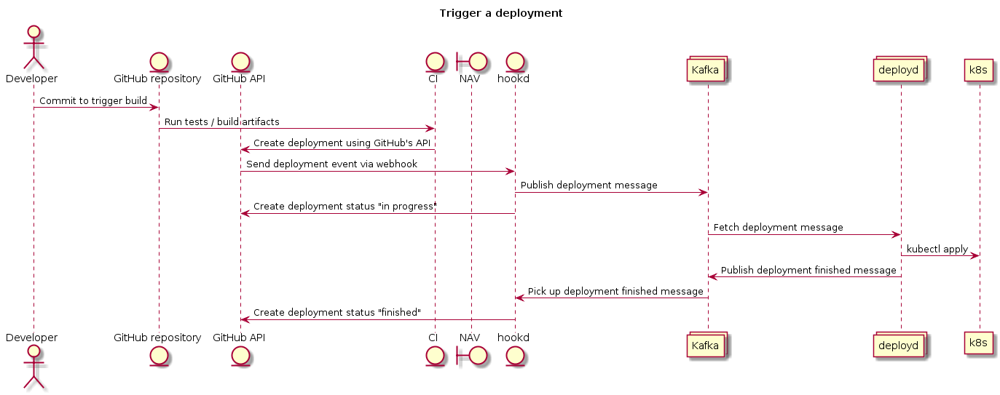

# Deployment orchestration in NAV
Documentation related to the deployment orchestration into Kubernetes using Github Deployments.

## Overview
The deployment process goes as follows (key parts of the process is explained in detail below):

1. [Create a deployment request](https://developer.github.com/v3/repos/deployments/#create-a-deployment) using GitHub's API, as part of the CI process of the application you want to deploy.
2. `hookd` receives the deployment request, and
   1. Creates deployment status using GitHub's API for invalid deployments, marking the deployment as a failure, which effectively short circuits the deployment process, or
   2. Publishes message to Kafka for all valid deployments.
3. `deployd` receives the request from Kafka and applies your _Kubernetes resources_ into the cluster of choice, on behalf of your team.
4. `deployd` publishes a message regarding the outcome of the deployment back to Kafka.
5. `hookd` receives message from Kafka and adds a corresponding deployment status using GitHub's API with the result of the deployment process.



The [NAV deployment](https://github.com/apps/nav-deployment) GitHub application is installed in all repositories owned by the `navikt` organization.
This application defines a webhook on all repositories. The webhook fires when CI pipelines creates a deployment on a repository using the
[GitHub Deployment API](https://developer.github.com/v3/repos/deployments/#create-a-deployment).


## Usage

### Prerequisites
* Your application must be [Naiserator compatible](https://github.com/nais/doc/tree/master/content/deploy). Deployment orchestration only acts on Kubernetes resources.
* Limit write access on your Github repository to team members. After activation, anyone with write access to the repository can deploy Kubernetes resources on behalf of your team.
* Be a maintainer of a [Github team](https://help.github.com/en/articles/about-teams). The team name must be the same as your Kubernetes _team label_.

### Registering your repository
You need to grant your Github repository access rights to deploy on behalf of your team.
In order to do this, you need to have _maintainer_ access rights to your Github team, and _admin_ access to the repository.

Visit the [registration portal](https://deployment.prod-sbs.nais.io/auth/login) and follow the instructions.

### Authenticating to the Github API
There are two ways to authenticate API requests: using a Github App, or with a personal access token.

The first option is unfortunately currently only available to Github organization admins. This means that you have to
[create a personal access token](https://help.github.com/en/articles/creating-a-personal-access-token-for-the-command-line)
that your CI pipeline can use to trigger the deployment.

The token needs only the scope `repo_deployment`.

Usage from curl looks like this:

```
% curl -u USERNAME:TOKEN https://api.github.com/...
```

### Making a deployment request
A deployment into the Kubernetes clusters starts with a POST request to the [GitHub Deployment API](https://developer.github.com/v3/repos/deployments/#create-a-deployment).
The request contains information about which environment to deploy to, which team to deploy as, and what resources should be applied.

Example request:
```
{
    "ref": "master",
    "description": "Automated deployment request from our pretty pipeline",
    "environment": "prod-sbs",
    "payload": {
        "version": [1, 0, 0],
        "team": "github-team-name",
        "kubernetes": {
            "resources": [
                { kind: "Application", apiVersion: "nais.io/v1alpha", metadata: {...}, spec: {...} },
                { kind: "ConfigMap", apiVersion: "v1", metadata: {...}, spec: {...} },
            ],
        }
    }
}
```

The data can be posted from standard input through curl using a command similar to:

```
curl \
    -X POST \
    -d@- \
    -H "Accept: application/vnd.github.ant-man-preview+json" \
    -u <USERNAME>:<TOKEN> \
    https://api.github.com/repos/navikt/<REPOSITORY_NAME>/deployments
```

### Deployment request spec

| Key | Description | Version added |
|-----|-------------|---------------|
| environment | Which environment to deploy to. | N/A |
| payload.version | This is the *payload API version*, as described below. Array of three digits, denoting major, minor, and patch level version. | 1.0.0 |
| payload.team | Github team name, used as credentials for deploying into the Kubernetes cluster. | 1.0.0 |
| payload.kubernetes.resources | List of Kubernetes resources that should be applied into the cluster. Your `nais.yaml` file goes here, in JSON format instead of YAML. | 1.0.0 |

#### Environment
Please use one of the following environments. The usage of `preprod-***` is *not* supported.
  * `dev-fss`
  * `dev-sbs`
  * `prod-fss`
  * `prod-sbs`

#### Payload API versioning
When making API requests, please use the most recent version `[1, 0, 0]`.

This version field have nothing to do with your application version. It is used internally by the deployment orchestrator to
keep things stable and roll out new features gracefully.

Changes will be rolled out using [semantic versioning](https://semver.org).

### Troubleshooting
First thing, check the logs. To get a link to your logs, please check the deployment status page at
`https://github.com/navikt/<YOUR_REPOSITORY>/deployments`.

Generally speaking, if the deployment is marked as `error`, the pipeline did not like your request and you need to fix something.
If the deployment is marked as `failure`, your application did not start as expected.
Any status like `queued`, `in progress` or `delayed` means that you need to wait for a status update.

#### Common errors

| Message | Action |
|---------|--------|
| Repository is not registered | Please read the [registering your repository](#registering-your-repository) section. |
| Deployment is `queued` forever | Did you specify the [correct environment](#environment) in the `environment` variable? |


## Application components

### hookd
This service will receive all deployment events from GitHub.

Its main tasks are to:
* validate deployment events
* publish messages to Kafka when a deployment is created
* report deployment status back to GitHub

The validation part is done by checking if the signature attached to the deployment event is valid, and by checking the format of the deployment. Refer to the [GitHub documentation](https://developer.github.com/webhooks/securing/) as to how webhooks are secured.

### deployd
Deployd's main responsibility is to deploy resources into a Kubernetes cluster. Additionally it reports the deployment status back to hookd using Kafka.

### Kafka
Kafka is used as a communication channel between hookd and deployd. Hookd sends deployment requests to a `deploymentRequests` topic, which fans out
and in turn hits all the deployd instances. Deployd acts on the information, and then sends a deployment status to the `deploymentStatus` topic.
Hookd picks up replies to this topic, and publishes the deployment status to Github.

### Amazon S3 (Amazon Simple Storage Service)
Used as a configuration backend. Information about repository team access is stored here, and accessed on each deployment request.


## Developing

### Compiling hookd and deployd
[Install Golang 1.12 or newer](https://golang.org/doc/install).

Check out the repository and run `make`. Dependencies will download automatically, and you should have two binary files at `hookd/hookd` and `deployd/deployd`.

### External dependencies
Start the external dependencies by running `docker-compose up`. This will start local Kafka and S3 servers.

The S3 access and secret keys are as follows:

```
export S3_ACCESS_KEY=accesskey
export S3_SECRET_KEY=secretkey
```

### Simulating Github deployment requests
Start a local Kafka instance as described above. Now run your local hookd instance, disabling Github interactions:
```
hookd/hookd --github-enabled=false --listen-address=127.0.0.1:8080
```

You might want to start up `deployd` as well:
```
deployd/deployd
```

Compile the `mkdeploy` tool:
```
cd hookd/cmd/mkdeploy
make
```

You can now run the tool, generating deployment requests as you go. Run `./mkdeploy --help` to see which options you can tweak.
