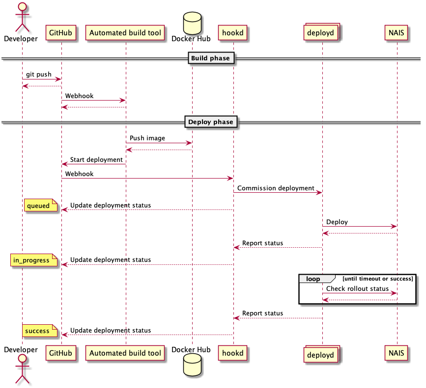

# NAIS deployment

## Overview
NAIS deploy facilitates application deployment into NAV's Kubernetes clusters.

Developers push or merge code into the master branch of a Git repository, triggering an automated build using (preferably) Github actions.
A successful build produces a Docker image artifact, which is uploaded onto Github package registry.
The final step in the build pipeline sends an API request to NAIS deploy to deploy the Docker image onto one of our Kubernetes clusters.



## How it works
1. The teams pipeline use `deploy` to send a deployment request to `hookd`.
1. `hookd` receives the deployment request, verifies its integrity and authenticity, and passes the message on to `deployd` via gRPC.
1. `deployd` receives the message from `hookd`, assumes the identity of the deploying team, and applies your _Kubernetes resources_ into the specified [cluster](https://doc.nais.io/clusters).
1. If the Kubernetes resources contained any _Application_ or _Deployment_ resources, `deployd` will wait until these are rolled out successfully, or a timeout occurs.

Any fatal error will short-circuit the process with a `error` or `failure` status posted back to Github. A successful deployment will result in a `success` status.
Intermediary statuses will be posted, indicating the current state of the deployment.

## Usage
The usage documentation has been moved to [NAIS platform documentation](https://doc.nais.io/deployment).

### Deploy API
_We strongly recommend that teams use the `deploy` cli to deploy, rather than posting directly to `hookd`._

Post to `/api/v1/deploy` to deploy one or more resources into one of our Kubernetes clusters.

Successful requests result in creation of a _deployment_ object on GitHub. Use this object
to track the status of your deployment.

#### Request specification
```json
{
  "resources": [
    {
      "kind": "Application",
      "apiVersion": "nais.io/v1alpha1",
      "metadata": { ... },
      "spec": { ... },
    }
  ],
  "team": "nobody",
  "cluster": "local",
  "environment": "dev-fss:default",
  "owner": "navikt",
  "repository": "deployment",
  "ref": "master",
  "timestamp": 1572942789,
}
```

| Field | Type | Description |
|-------|------|-------------|
| resources | list[object] | Array of Kubernetes resources |
| team | string | Team tag |
| cluster | string | Kubernetes cluster, see [NAIS clusters](https://doc.nais.io/clusters) |
| environment | string | GitHub environment |
| owner | string | GitHub repository owner |
| repository | string | GitHub repository name |
| ref | string | GitHub commit hash or tag |
| timestamp | int64 | Current Unix timestamp |

Additionally, the header `X-NAIS-Signature` must contain a keyed-hash message authentication code (HMAC).
The code can be derived by hashing the request body using the SHA256 algorithm together with your team's NAIS Deploy API key.

#### Response specification

```json
{
  "logURL": "http://localhost:8080/logs?delivery_id=9a0d1702-e7c5-448f-8a90-1e5ee29a043b&ts=1572437924",
  "correlationID": "9a0d1702-e7c5-448f-8a90-1e5ee29a043b",
  "message": "successful deployment",
  "githubDeployment": { ... }
}
```

| Field | Type | Description |
|-------|------|-------------|
| logURL | string | Direct link to human readable frontend where logs for this specific deployment can be read |
| correlationID | string | UUID used for correlation tracking across systems, especially in logs |
| message | string | Human readable indication of API result |
| githubDeployment | object | [Data returned from GitHub Deployments API](https://developer.github.com/v3/repos/deployments/#get-a-single-deployment) |

#### Response status codes

| Code | Retriable | Description |
|-------|------|-------------|
| 201 | N/A | The request was valid and will be deployed. Track the status of your deployment using the GitHub Deployments API. |
| 400 | NO | The request contains errors and cannot be processed. Check the `message` field for details.
| 403 | MAYBE | Authentication failed. Check that you're supplying the correct `team`; that the team is present on GitHub and has admin access to your repository; that you're using the correct API key; and properly HMAC signing the request. |
| 404 | NO | Wrong URL. |
| 5xx | YES | NAIS deploy is having problems and is currently being fixed. Retry later. |


## Application components

### hookd
This service communicates with Github, and acts as a relay between the Internet and our Kubernetes clusters.

Its main tasks are to:
* validate deployment events
* relay deployment requests to _deployd_ using gRPC
* report deployment status back to GitHub

The validation part is done by checking if the signature attached to the deployment event is valid, and by checking the format of the deployment.
Refer to the [GitHub documentation](https://developer.github.com/webhooks/securing/) as to how webhooks are secured.

### deployd
Deployd's responsibility is to deploy resources into a Kubernetes cluster, and report state changes back to hookd using gRPC.

### gRPC
gRPC is used as a communication protocol between hookd and deployd. 
Hookd starts a gRPC server with a deployment stream and a status service. 
Deployd registers as a client on Hookd.
When Hookd receives a deployment request, it adds it to the relevant gRPC deployment stream. 
Deployd acts on the information, and then sends a deployment status to the gRPC status service on Hookd.
Hookd publishes the deployment status to Github.

### Compiling
[Install Golang 1.15 or newer](https://golang.org/doc/install).

Check out the repository and run `make`. Dependencies will download automatically, and you should have three binary files at `bin/hookd`, `bin/deployd`, `bin/deploy` and `bin/provision`.

To run the integration tests, please download and use a Kubernetes test environment:

```
# change into the home directory before running `go install`
cd
go install sigs.k8s.io/controller-runtime/tools/setup-envtest@latest
# note: for Apple Silicon, add: `--os darwin --arch amd64`
source <(setup-envtest use -p env)
```

## Running locally

For a combination of more tools running locally ([hookd](https://github.com/nais/deploy), [Console frontend](https://github.com/nais/console-frontend) and more), check out the [nais/features-dev](https://github.com/nais/features-dev) repo. 

### Postgres
Start the database by running `docker-compose up`. This will start an empty local database.
When you start `hookd`, the schema will be patched to current version.
If this is the first time running this database, you have to add a dummy deployment key for deploy to work.
In this case, the deployment key is `20cefcd6bd0e8b8860c4ea90e75d7123019ed7866c61bd09e23821948878a11d`.

```bash
psql -U postgres -h localhost -p 5432 hookd <<< EOF
insert into
    apikey (key, team, created, expires)
    values ('1608bf2caf81bb68d50bfb094a8e0d90de2b27260767a64a0103c6255077eb446f4fabcb7ae94514380b4fdc006bd50dfe2ea73f4b60c0c55891a60f',
            'aura', now(),now()+interval '10 years');
EOF
```

### Hookd
run `./bin/hookd`
For local development, hookd will by default start with an insecure listener and github integration disabled.
secure listener can be turned on passing the following flags:
```
--grpc-authentication                Validate tokens on gRPC connection.
```
Github integration can be turned on using the following flags:
```
--github-app-id int                  Github App ID.
--github-client-id string            Client ID of the Github App.
--github-client-secret string        Client secret of the GitHub App.
--github-enabled                     Enable connections to Github.
--github-install-id int              Github App installation ID.
--github-key-file string             Path to PEM key owned by Github App. (default "private-key.pem")
```

### Deployd
To enable secure listener in deployd, the following flags apply:
```
--grpc-authentication           Use token authentication on gRPC connection.
--grpc-use-tls                  Use secure connection when connecting to gRPC server.
```

### Deploy
Once the above components are running and configured, you can deploy using the following command:

```
./bin/deploy \
    --resource resource.yaml \
    --cluster local \
    --apikey 20cefcd6bd0e8b8860c4ea90e75d7123019ed7866c61bd09e23821948878a11d \
    --deploy-server localhost:9090 \
    --grpc-authentication=false \
    --grpc-use-tls=false \
    --wait \
;
```

```
./bin/deploy --resource res.yaml --cluster local --apikey 20cefcd6bd0e8b8860c4ea90e75d7123019ed7866c61bd09e23821948878a11d --deploy-server http://localhost:8080 --wait
```

## Verifying the deploy images and their contents

The images are signed "keylessly" (is that a word?) using [Sigstore cosign](https://github.com/sigstore/cosign).
To verify their authenticity run
```
cosign verify \
--certificate-identity "https://github.com/nais/deploy/.github/workflows/release.yml@refs/heads/master" \
--certificate-oidc-issuer "https://token.actions.githubusercontent.com" \
europe-north1-docker.pkg.dev/nais-io/nais/images/deploy@sha256:<shasum>
```

The images are also attested with SBOMs in the [CycloneDX](https://cyclonedx.org/) format.
You can verify these by running
```
cosign verify-attestation --type cyclonedx  \
--certificate-identity "https://github.com/nais/deploy/.github/workflows/release.yml@refs/heads/master" \
--certificate-oidc-issuer "https://token.actions.githubusercontent.com" \
europe-north1-docker.pkg.dev/nais-io/nais/images/deploy@sha256:<shasum>
```
